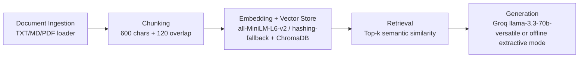

# Project 1 Planning: The Unofficial Guide

## Domain
I chose **off-campus student housing experiences** near a university. This knowledge is valuable because official housing websites mostly show pricing and amenities, but students care about hidden operational details like maintenance speed, noise, mold, parking constraints, and leasing-office responsiveness. Those insights are scattered across informal threads and are hard to search systematically.

## Documents
| # | Source | Description | URL or location |
|---|--------|-------------|-----------------|
| 1 | Hillview forum thread | Lottery process and maintenance/noise feedback | `documents/housing/01_hillview_forum.txt` |
| 2 | Cedar Court Reddit summary | Cost/utilities and move-in support quality | `documents/housing/02_cedar_reddit.txt` |
| 3 | Rivergate review digest | Walkability, laundry, and parking behavior | `documents/housing/03_rivergate_review.txt` |
| 4 | Oak Crossing Q&A archive | Bug reports and repair turnaround | `documents/housing/04_oak_crossing_forum.txt` |
| 5 | Maple Square student blog notes | Commute and transit reliability | `documents/housing/05_maple_square_blog.md` |
| 6 | Harbor Point HTML snippet | Noise and study-space quality with HTML boilerplate | `documents/housing/06_harbor_point_html.txt` |
| 7 | Elm Lofts spreadsheet notes | Price and amenities reliability | `documents/housing/07_elm_lofts_sheet.txt` |
| 8 | Pine Gardens Discord transcript | Non-emergency maintenance timing | `documents/housing/08_pine_gardens_discord.txt` |
| 9 | Summit House FAQ | Utility inclusion/exclusions and lease terms | `documents/housing/09_summit_house_faq.txt` |
| 10 | Lakeside student thread | Mold risk and move-in precautions | `documents/housing/10_lakeside_thread.txt` |

## Chunking Strategy
**Chunk size:** 600 characters  
**Overlap:** 120 characters  
**Reasoning:** These source documents are short, review-like notes where each document usually contains 2–5 claims. A medium chunk size keeps each claim bundle together while avoiding giant mixed-topic passages. Overlap helps preserve meaning if a claim is near a chunk boundary. Boundary-aware splitting prefers sentence/paragraph edges to avoid broken fragments.

## Retrieval Approach
**Embedding model:** `all-MiniLM-L6-v2` (primary intent), with local `hashing-fallback` when model download is unavailable in sandboxed/offline environments.  
**Top-k:** 4  
**Production tradeoff reflection:** For production, I would compare local and API-hosted embeddings on domain recall, latency, and multilingual support. Larger embedding models may improve semantic matching for paraphrased housing questions but increase cost and latency. I would also evaluate context-length compatibility with my generator and whether metadata-aware reranking improves precision over pure vector similarity.

## Evaluation Plan
| # | Question | Expected answer |
|---|----------|-----------------|
| 1 | Is Hillview's housing lottery fully random for all applicants? | Not fully random at the start: renewals are processed first, then remaining units are assigned by lottery. |
| 2 | Which housing option is described as the cheapest two-bedroom and about how much does it cost per person? | Cedar Court, around $980 per person plus utilities. |
| 3 | Which complex has very slow non-emergency maintenance and how long do requests take? | Pine Gardens; non-emergency requests often take 5–7 days. |
| 4 | At Summit House, which utilities are included and which are extra? | Water and trash included; electricity and parking are extra. |
| 5 | Which place has repeated mold complaints and what precaution did students recommend? | Lakeside Commons; request a pre-move inspection and document damage with photos. |

## Anticipated Challenges
1. **Noisy retrieval for mixed-topic short notes:** Similar lexical terms (e.g., “maintenance”, “cost”, “parking”) can pull partially related chunks that dilute final answers.
2. **Grounding drift during generation:** If context includes both relevant and semi-relevant chunks, the model may blend unrelated claims unless prompt constraints and citation formatting are strict.

## Architecture

## AI Tool Plan
**Milestone 3 — Ingestion and chunking:** I will provide the Domain, Documents, and Chunking Strategy sections to an AI coding assistant and ask it to implement document loading, cleaning, and chunking with overlap and boundary-aware splitting. I expect Python functions plus CLI wiring, then I will verify behavior by inspecting sample chunks.

**Milestone 4 — Embedding and retrieval:** I will provide the Retrieval Approach and Architecture sections and ask the AI to implement vector indexing/retrieval using ChromaDB and sentence-transformers. I expect index/query commands and source metadata tracking, then I will verify retrieval quality with targeted test questions.

**Milestone 5 — Generation and interface:** I will provide grounding requirements and evaluation criteria and ask the AI to implement query answering with mandatory citations in a CLI flow. I expect a grounded prompt template and output formatting. I will verify that answers include source citations and reject unsupported claims.
